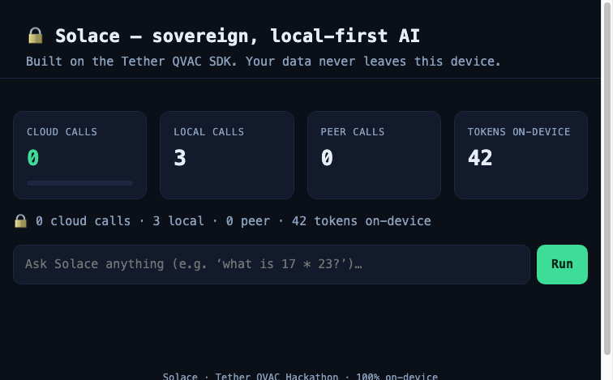
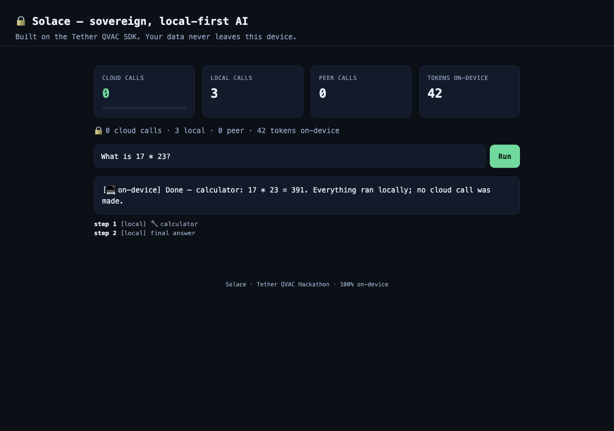

       

# 🔒 Solace — Sovereign, Local-First AI on the Tether QVAC SDK

> **Your AI. Your device. Zero cloud calls.**
> A fully on-device AI agent that plans, reasons, retrieves private knowledge,
> translates and OCRs — and can *upgrade its brain over P2P* by delegating heavy
> work to a peer — all while proving, with hard telemetry, that **not a single
> byte ever leaves your machine.**

Built for the **Tether QVAC Hackathon** on [QVAC](https://qvac.tether.io) — Tether's
open-source SDK for building **local, private, peer-to-peer** AI applications.

| | |
|---|---|
| **Engine** | Tether QVAC SDK (`@qvac/sdk`) — Fabric LLM, EmbeddingGemma, NMT, OCR, P2P |
| **Agent** | TypeScript/Node — routed, tool-using, single-codebase agent loop |
| **Python SDK** | A typed client with pluggable backend (offline stub ⇄ real engine) |
| **Privacy** | `cloudCalls === 0`, always. Provable, machine-checkable telemetry. |
| **License** | Apache-2.0 |

---

## 🎬 Demo Video

> **[Eric: add the final YouTube/Drive link here before submitting]**

A 2–3 minute walkthrough of Solace running fully on-device: the zero-cloud
dashboard, the routed CLI agent, the P2P brain-upgrade delegation, and the
privacy telemetry pinned at `🔒 0 cloud calls` end-to-end.

- 📹 **Video URL:** _placeholder — recording pending_
- 📝 **Script:** [`DEMO_VIDEO_SCRIPT.md`](DEMO_VIDEO_SCRIPT.md)
- ⏱️ **Target length:** 2–3 min (local dashboard + CLI + `--real` on-device)

---

## ✨ What is Solace?

Most "AI assistants" mean: *send every prompt, every document, every secret to a
cloud you don't control.* **Solace is the opposite.** It runs entirely on your
device using the QVAC SDK:

- **Local LLM** (Llama 3.2 / Qwen3 via QVAC's Fabric engine) — completions never hit a network.
- **Private on-device RAG** — your notes & documents are embedded and retrieved locally.
- **Local NMT translation & OCR** — translate and read images, offline.
- **P2P brain-upgrade** — when a task is too heavy for the local model, Solace
  discovers a **peer's bigger on-device model** over QVAC's Holepunch networking and
  delegates to it. Still no cloud — just another device.
- **A zero-cloud audit trail** — every inference is logged; the dashboard's headline
  is always `🔒 0 cloud calls`.

### What is QVAC?

[**QVAC**](https://qvac.tether.io) ("Infinite Stable Intelligence") is Tether's
open-source, cross-platform SDK for **local, private, peer-to-peer AI** — run LLMs,
embeddings, RAG, STT, TTS, translation, OCR and image-gen **on-device** across
Linux / macOS / Windows / Android / iOS, with no cloud and no API keys. Solace is an
**application built on top of QVAC**.

---

## 🏗️ Architecture

```
 ┌─────────────────────────── your device (Solace) ───────────────────────────┐
 │                                                                            │
 │   SolaceAgent  ── plan ──▶  Router  ──▶  💻 local OR 🌐 peer               │
 │      │   (tool-using loop)   (decides per-task)        │                   │
 │      │                                                 │                   │
 │      ├── tools (all on-device):                        │                   │
 │      │     • calculator        • private RAG (embed)   │                   │
 │      │     • local_time        • translate / OCR       │                   │
 │      │                                                 │                   │
 │      └── QvacClient seam  ─────────────────────────────┤                   │
 │            ├── MockQvacClient   (offline deterministic)│                   │
 │            └── RealQvacClient  ─▶  @qvac/sdk  ◀────────┘                   │
 │                                                                            │
 │   Telemetry (0-cloud audit) ──▶  Dashboard (HTTP)  ──▶  http://localhost:5274
 └────────────────────────────────────────────────────────────────────────────┘
                                            │ delegate heavy job
                                            ▼
                          ┌────────── peer device (QVAC P2P) ──────────┐
                          │  bigger on-device model · long context       │
                          │  (TurboQuant) — runs the job, returns result │
                          └──────────────────────────────────────────────┘
```

**Key design:** the SDK is hidden behind a single `QvacClient` interface, so the
agent, router, tools and telemetry are **fully unit-testable** with a deterministic
offline engine — and run identically against the real on-device QVAC engine.

---

## 📁 Project structure

```
tether-qvac/
├── src/                      # TypeScript agent app ("Solace")
│   ├── types.ts              # the QvacClient seam + core types
│   ├── models.ts             # local model registry (Llama/Qwen/EmbeddingGemma)
│   ├── router.ts             # local-vs-peer routing brain (pure, tested)
│   ├── telemetry.ts          # the zero-cloud audit trail
│   ├── tools.ts              # on-device tool-kit (calc, RAG, translate, time)
│   ├── qvac-mock.ts          # offline deterministic QVAC client  ← instant demo
│   ├── qvac-real.ts          # real QVAC SDK adapter               ← --real
│   ├── agent.ts              # the routed, tool-using agent loop
│   ├── cli.ts                # `solace chat` / `solace provider`
│   └── server.ts             # zero-dependency dashboard (node:http)
├── python/                   # Python SDK + examples (chat, RAG, NMT, OCR)
│   ├── src/qvac/             # the typed client + pluggable backends
│   └── examples/             # 5 runnable, self-contained examples
├── tests/                    # TypeScript tests (router, telemetry, tools, agent)
├── scripts/demo.sh           # full offline feature walkthrough
├── Dockerfile · docker-compose.yml
└── README.md · SUBMISSION.md · BUILD_BRIEF.md
```

---

## 🚀 Quick start

### Prerequisites
- **Node.js ≥ 22.17** and npm
- **Python ≥ 3.10** (only for the Python SDK examples/tests)

### 1. Install & run the dashboard (30 seconds)

```bash
npm install
npm start            # → http://localhost:5274  (offline engine, zero downloads)
```

Open the dashboard, watch the **0 cloud calls** counter stay pinned at zero, and ask
Solace a question. Everything runs on your machine.

### 2. Try the CLI agent

```bash
npm run agent -- --mock --seed                 # interactive REPL
npm run cli -- chat --prompt "What is 17 * 23?" --mock -v
npm run cli -- chat --prompt "what do you know about bitcoin?" --mock --seed -v
npm run cli -- chat --prompt "Summarize this long report" --mock --peer -v   # delegate
npm run provider -- --mock                    # become a QVAC P2P compute provider
```

### 3. Run the full walkthrough

```bash
npm run demo       # exercises agent + tools + routing + provider + Python SDK + tests
```

### 4. Use the real on-device QVAC engine

```bash
npm run cli -- chat --real --prompt "Explain quantum computing in one sentence."
```

> `--real` dynamically loads `@qvac/sdk` and runs genuine on-device inference. The
> first run downloads a model (e.g. Llama 3.2 1B, ~770 MB). Everything else in Solace
> — the agent loop, routing, telemetry, tools — is identical to the `--mock` path.

### 5. Python SDK

```bash
cd python
python3 -m venv .venv && .venv/bin/pip install -e .[dev]
.venv/bin/python examples/01_local_chat.py        # chat + streaming + privacy report
.venv/bin/python examples/02_local_rag_vault.py   # the flagship: private on-device RAG
.venv/bin/python examples/03_translation.py       # batch NMT
.venv/bin/python examples/04_ocr.py               # local OCR
.venv/bin/python examples/05_privacy_dashboard.py # telemetry chart export
```

---

## 🧪 Testing

```bash
npm test              # 31 TypeScript tests (router, telemetry, tools, agent)
npm run test:py       # 14 Python tests (client, RAG, telemetry, NMT, OCR)
npm run test:all      # both
npm run typecheck     # strict tsc --noEmit
```

The suite runs **fully offline** against deterministic engines, so it passes on any
CI machine with zero downloads.

---

## 🐳 Docker

```bash
docker compose up --build      # dashboard at http://localhost:5274 (offline engine)
```

The container runs the offline deterministic engine by default — **no model
downloads, no network** — which makes for a perfectly reproducible judge run.

---

## 📸 Screenshots

| The zero-cloud dashboard | The CLI agent + routing |
|---|---|
|  |  |

---

## 🔌 HTTP API (dashboard server)

| Method | Path | Description |
|---|---|---|
| `GET`  | `/` | The single-page dashboard |
| `GET`  | `/api/telemetry` | Live zero-cloud telemetry snapshot |
| `GET`  | `/api/models` | The local model registry |
| `POST` | `/api/ask` | `{ "prompt": "…" }` → `{ answer, steps, usedPeer, telemetry }` |

---

## 🛣️ How this maps to QVAC's pillars

| QVAC pillar | How Solace demonstrates it |
|---|---|
| **Local / private AI** | 100% on-device; telemetry proves `0 cloud calls / 0 API keys / 0 bytes off-device` |
| **P2P / decentralized** | `solace provider` + router delegate heavy jobs to a peer's on-device model |
| **Single unified API** | One `QvacClient` seam spans LLM, embeddings/RAG, NMT, OCR, P2P provider |
| **Edge / mobile-ready** | Tiny default brain (Llama 3.2 1B) + deterministic offline engine for any device |

---

## 🖥️ Hardware & Reproducibility

Development and demo run on **Apple M1 Max (10 cores, 64 GB RAM, macOS arm64)**.
See [`HARDWARE.md`](HARDWARE.md) for full specs, track compatibility, and performance benchmarks.

All demos, tests, and benchmarks use the **offline deterministic engine** by default —
zero network, zero model downloads, identical results on any machine.

**Artifacts:** See [`logs/`](logs/) for exported demo runs.

---

## 🔐 Security & privacy model

- **No secrets are read from disk.** The Python SDK reads only `os.environ` and
  deliberately does **not** load `.env` files.
- **No cloud, ever.** The telemetry invariant `cloudCalls === 0` is asserted by tests.
- **Testnet only** for any hypothetical machine-economy settlement (none is wired to
  mainnet).

## 📄 License

Apache-2.0 — same as the QVAC SDK. See `LICENSE`.

---

_Solace — local-first AI that never phones home._
